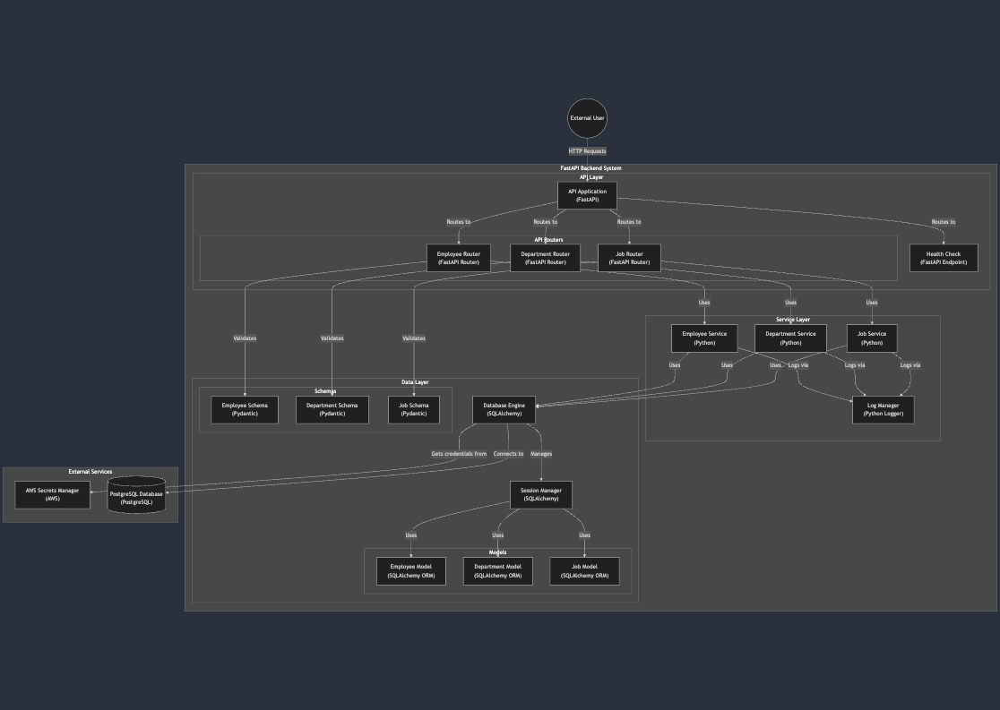
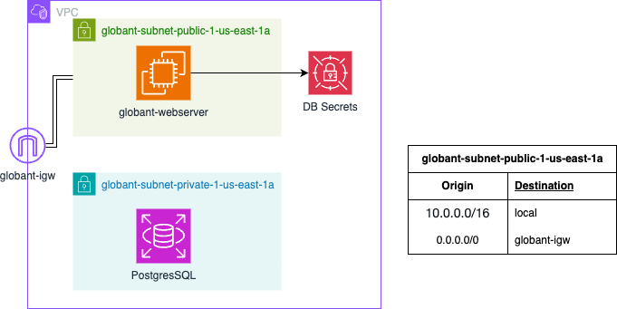

# GlobantDETest

This project implements an employee management system with three different deployment versions, each representing an evolution in the architecture and deployment strategy from local development to cloud-based solutions. The system manages employee records, departments, and job roles through a FastAPI backend with PostgreSQL database.

## Table of Contents
- [GlobantDETest](#globantdetest)
  - [Table of Contents](#table-of-contents)
  - [Overview](#overview)
  - [Project Structure](#project-structure)
  - [System Architecture](#system-architecture)
    - [Overall System Design](#overall-system-design)
    - [Data Model](#data-model)
  - [Deployment Versions](#deployment-versions)
    - [Version 1: Local Development](#version-1-local-development)
    - [Version 2: AWS Basic (aws-v1)](#version-2-aws-basic-aws-v1)
    - [Version 3: AWS Enhanced (aws-v2)](#version-3-aws-enhanced-aws-v2)
  - [Security Considerations](#security-considerations)
    - [AWS Deployments](#aws-deployments)
  - [Setup and Deployment](#setup-and-deployment)
    - [Local Development \& Basic AWS (Version 1)](#local-development--basic-aws-version-1)
      - [Considerations for AWS](#considerations-for-aws)
    - [AWS Deployment (Version 2)](#aws-deployment-version-2)
  - [API Documentation](#api-documentation)
  - [Testing](#testing)

## Overview

The Employee Management System is a comprehensive solution for managing employee records, departments, and job roles. It provides a RESTful API built with FastAPI, uses PostgreSQL for data persistence, and offers multiple deployment options from local development to cloud-based solutions.

## Project Structure

```
GLOBANDTEST/
├── assets/                  # Static assets and resources
├── models/                  # SQLAlchemy ORM models
├── routers/                 # FastAPI route definitions
├── schemas/                 # Pydantic models for request validation
├── services/               # Business logic implementation
├── tests/                  # Test suite directory
├── utils/                  # Utility functions and helpers
├── .env                   # Environment variables
├── .env.test             # Environment variables for testing
├── .gitignore            # Git ignore rules
├── database.py           # Database utilities
├── docker-compose.test.yaml  # Docker compose for testing environment
├── docker-compose.yaml      # Docker compose
├── Dockerfile            # Main application Dockerfile
├── Dockerfile.test       # Test environment Dockerfile
├── main.py              # Application entry point
├── README.md            # Project documentation
├── requirements_test.txt # Test dependencies
├── requirements.txt     # Project dependencies
```

## System Architecture

### Overall System Design


The system follows a layered architecture pattern with clear separation of concerns:
- API Layer (FastAPI): This layer is responsible for handling HTTP requests and responses. It defines endpoints, routes, and data validation using FastAPI
- Service Layer: This layer contains business logic and orchestrates data access. It interacts with the Data Layer to fetch and manipulate data.
- Data Layer: This layer is responsible for interacting with the databases.

Additionally after modifications for using AWS services, and adding External Services Integration, the architecture changed to following one:

- External Services Integration: This layer interact with external services. In this case AWS Secrets Manager and AWS RDS

### Data Model


The system is built around three core entities:
- **Employee**: Stores employee information including name, hiring date, department, and job role
- **Department**: Manages department information
- **Job**: Defines available job roles

Each entity is related through foreign keys, ensuring data integrity and enabling complex queries.

## Deployment Versions

### Version 1: Local Development
- Fully containerized using Docker Compose
- Single machine deployment
- Ideal for development and testing

### Version 2: AWS Basic (aws-v1)


Features:
- VPC with public subnet
- EC2-hosted web server
- Containerized application

### Version 3: AWS Enhanced (aws-v2)


Improvements:
- Public and private subnet architecture
- RDS for PostgreSQL database
- AWS Secrets Manager integration
- Enhanced security measures for DB access

## Security Considerations

### AWS Deployments
Our AWS infrastructure implements a defense-in-depth approach with multiple security layers:

- **VPC Isolation**: Dedicated VPC with public and private subnets and routing controls
- **Security Groups**: Granular access control for EC2 instances and RDS, limiting inbound traffic to necessary ports and known sources
- **IAM Management**: Least-privilege access policies for EC2 instances to access Secrets Manager
- **Network Segregation**: Three-tier architecture separating public-facing components (Internet gateway), application layer (EC2), and data layer (RDS)
- **Secrets Management**: AWS Secrets Manager for secure credential storage
- **RDS Security**: Encryption at rest and in transit, and automated backups.

## Setup and Deployment

### Local Development & Basic AWS (Version 1)
1. Clone the repository:
```bash
git clone https://github.com/amanrique1/GlobantDETest
cd GlobantDETest
```

2. Create and configure `.env` and `.env.test` file:
```bash
nano .env
```
i.e
```
DB_USER=amanrique1
DB_PASSWORD=admin
DB_NAME=companydb
DB_HOST=postgres
DB_PORT=5432
```

3. Start the application:
```bash
docker-compose up -d
```

#### Considerations for AWS
- Package Installation (docker, docker-compose, git): These tools are essential for managing and deploying applications in a containerized environment.
  - Docker: Allows package the application and its dependencies into a lightweight, portable container.
  - Docker Compose: Enables running the multi-container app with a single command.
  - Git: A version control system used for cloning the repository
- Public Subnet: A subnet within the VPC (Virtual Private Cloud) that has access to the public internet for receiving requests.
- Public IP: A unique IP address that is routable on the public internet. Allows the instance to communicate with other systems outside of the VPC.
- Security Group Setup: firewall for the instance that controls inbound and outbound traffic based on defined rules. Helps to protect instances from unauthorized access.

### AWS Deployment (Version 2)
1. Create EC2
2. Create RDS instance
3. Set up Secrets Manager with RDS credentials
4. Create role for accessing Secrets manager from EC2
5. Assign role to EC2 instance
6. Deploy updated application version (`aws` branch)

## API Documentation

The API documentation is available at `/docs` when running the application. It provides:
- Interactive API documentation
- Request/response examples
- Schema information
- Authentication details

## Testing

Run the test suite:
```bash
docker-compose -f docker-compose.test.yaml up --build
```

Run the compose and test with Postman or any other tool. Jupyter Notebook sample available
```bash
docker-compose up --build
```
Modify `host` variable in `mini_test.ipynb` and run all.